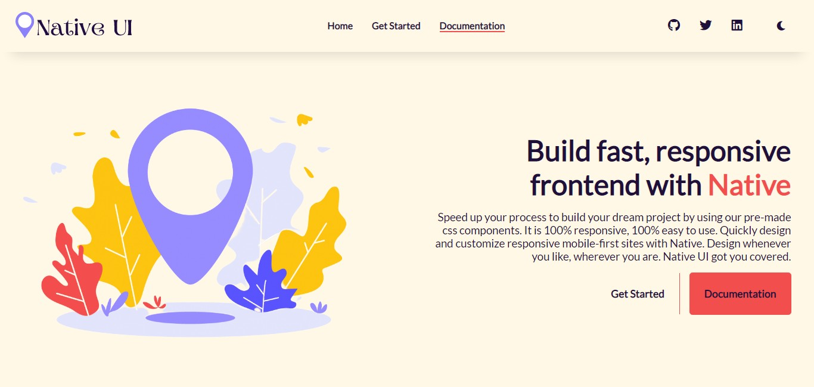

<div align="center">


  
# NATIVE UI

### Build Fast, Responsive Frontend with Native. Night Mode now available.

#### Use pre-made components to focus more on logic. 




</div>

---

## How to get started?

To start using the components in your project, you can add the below `<link>` inside your `<head>` section of your page. Make sure to keep this on top of all other `stylesheets` if you are using any. Also, if you import `native-ui.css` in your css file make sure it goes on the top too.

```html
<link rel="stylesheet" href="https://native-ui.netlify.app/native-ui.css">
```

---

## List Of Components Available.
### More components would be coming soon. Also, the existing ones could be updated.

<ul>
  <li>Alert</li>
  <li>Avatar</li>
  <li>Badge</li>
  <li>Button</li>
  <li>Card</li>
  <li>Grid</li>
  <li>Image</li>
  <li>Input</li>
  <li>List</li>
  <li>Navigation</li>
  <li>Rating</li>
  <li>Slider</li>
  <li>Snackbar</li>
  <li>Typography</li>
</ul>

---
## Overview of each component

### Alert

Alerts are used to provide contexual feedback messages. It displays in a virtual box that pops up on the screen.
<br />
Types:
* Simple Alert
  - primary
  - secondary
  - danger
  - warning
  - success
* Alert with icon
* Alert with dismiss

<hr />

### Avatar

The Avatar component is used to represent a user, and displays the profile picture, initials or fallback icon.
<br />
Types:
* Avatar with Image
* Avatar with Text

<hr />

### Badge

The Badge component is used to represent a user's status - online, offline etc. They can also be used to display a notification or cart count.
<br />
Types:
* Badge on icons
* Badge on avatar

<hr />

### Buttons

The Button component is used to trigger an action or event, such as submitting a form, opening a dialog, canceling an action, or performing a delete operation.
<br />
Types:
* Button varieties
  * Primary
  * Secondary
  * large
  * ghost
  * links
  * Floating Buttons
  * Icon Buttons

<hr />

### Cards

A card is a flexible and extensible content container. It includes options for headers and footers, a wide variety of content, contextual background colors, and powerful display options.
<br />
Types:
* Horizontal card
* Vertical card
* Text only card
* Vertical card with badge
* Vertical card with overlay
* Vertical card with dismiss

<hr />

### Grids

Grids are very useful in arranging the content over the website hasle free.
<br />
Types:
* 2 column grid
* 3 column grid
* 4 column grid
* 20-80 column grid

<hr />

### Images

Images are an integral part of the content strategy of any website. 
<br />
They convey some important information without the need of textual content.
Types:
* Square image
  - responsive
* Round image
  - responsive
      - small
      - medium

<hr />

### Inputs and Forms

Inputs are the main component that is used for user's interaction with the web app. Inputs are used to take important information from the user, and then save the data.
<br />
Types:
* Password input
* Email input
* Text area input
* Checkbox group
* Radio group
* Form Validation
<hr />

### Lists

List are very useful components for handling structure and/or order of text on website.
<br />
Types:
* Basic list
  * Bullet
  * Circle
  * Square
  * Roman
  * Decimal
  * Alphabet
  * Triangle
* Stacked list ( eg. notifications )

<hr />

### Modal (live example added)

Modals are built with HTML, CSS, and JavaScript. They’re positioned over everything else in the document and remove scroll from the so that modal content scrolls instead.
<br />
Types:
* Modal with two buttons

<hr />

### Navigation

A Navigation bar helps in accessing information. It is the UI element on a webpage that includes links for the other sections of the website.
<br />The navbar provided by native is also responsive. It will turn into a hamburger menu when the width decreases.
<br />

Types:
* Desktop navigation
* Mobile Navigation (Hamburger Implemented)

<hr />

### Ratings

Native's 5-star ratings component can be used to allow the users to share their opinion about the
<br />
                    product, documentation page, photo and more.
<br />
Types:
* Ratings

<hr />

### Toast (with live example)

Toasts, sometimes called snackbars or banners, make for great medium-attention notifications because they are non-disruptive.
<br /> 
Users can continue using the product while being informed about the (hopefully) important stuff and any
<br />
supplementary options to the current user action.
<br />

Types:
* Baseline
* Leading
* Stacked


<hr />

### Typography

Typography is a feature of Native UI for styling and formatting the text content.
<br />
It is used to create customized headings, inline subheadings, lists, paragraphs, aligning, adding more design-oriented font styles and much more.
<br />
Types:
* Heading
* Paragraph
* Text alignment
* Text decoration (strikethrough etc)
* Weighted Text
* Transformation Texts
---

PLEASE ⭐ IF YOU LIKED IT. 
